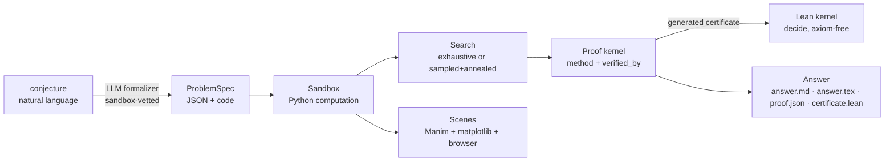

# SimAgent

**Play with conjectures in a sandbox instead of fighting equations.**

Working on math purely through equations is intimidating and bottlenecked —
especially proving things. But many problems (geometric ones most of all) are
*visualizable*: you can build a world, poke it, and watch what happens. SimAgent
is a harness built on that idea:

> **Input:** a conjecture.
> **Middle:** an executable 3D sandbox simulation of the conjecture, visualized
> (Manim + matplotlib), with an automated search playing in it.
> **Output:** a mathematical answer — a certified counterexample, a witness, or
> honest evidence — written up in LaTeX and sketched in Lean. Equations are the
> *representation* of what happened in the sandbox, not the medium of work.

SimAgent is an **agent harness** in the spirit of
[pi](https://github.com/earendil-works/pi): a small, correctness-first kernel
with a strict split — the LLM (or you) reasons; the harness only records what
it can *execute or check*; the Lean kernel is the sole authority on deduction.
Three pillars: **Python** computes, **Lean** formulates and verifies, **Manim**
visualizes. See [ARCHITECTURE.md](ARCHITECTURE.md).



## Proofs, by method

Every answer names one of the ten classical proof methods and carries a
`verified_by` stamp only the proof kernel may assign:

| method | verified by |
|---|---|
| **counterexample** | harness (exact rationals) **+ Lean kernel** (generated certificate, axiom-free) |
| **construction** | same machinery, for existence witnesses |
| **exhaustion** | every case of a finite integer domain checked **+ Lean `decide`** |
| direct, contradiction, contrapositive, induction, cases, combinatorial, infinite descent | **Lean only** — the harness never grades prose; an LLM attempt without kernel-accepted Lean is recorded as `verified_by: none` |

Sampling evidence ("no counterexample in N trials") is never called a proof.

## Quickstart (no API key needed)

```bash
uv venv .venv && uv pip install -p .venv/bin/python -e ".[dev]"
.venv/bin/simagent list
.venv/bin/simagent solve circumcenter-in-tetrahedron --trials 2000
```

Four conjectures are bundled and run fully offline — each is a known-answer
test for the whole machine:

| id | truth | method the harness reaches |
|---|---|---|
| `circumcenter-in-triangle` | false | **counterexample**, `sandbox+lean` |
| `circumcenter-in-tetrahedron` | false | **counterexample**, `sandbox+lean` |
| `sum-of-odds-square` | true (bounded) | **exhaustion** — all 201 cases + Lean `decide` |
| `euler-characteristic-hull` | true | no proof — *evidence only*, and it says so |

A run directory contains the whole story:

```
runs/<id>-seed0/
  spec.json        the conjecture as executable ProblemSpec
  report.json      search report (verdict, witness, margins, certification)
  scene.json       3D scene graph of the decisive configuration
  preview.png      matplotlib 3D render (always)
  scene_manim.py   self-contained Manim ThreeDScene (render any time)
  answer.md        readable verdict + witness + method
  answer.tex       classical LaTeX write-up
  conjecture.lean  Lean 4 / Mathlib skeleton (flagged unchecked)
```

Example verdict from the tetrahedron run — note the witness is *exact*:

> **DISPROVED — certified counterexample (exact rational arithmetic)**
> `T = (−1, −7/11, 8/11), (1/5, −1, −1/6), (−1/16, −9/11, 9/16), (−13/14, −4/15, 1/16)`

## The browser sandbox (recommended)

```bash
.venv/bin/simagent web
```

Opens `http://127.0.0.1:8642` — a live 3D sandbox in your browser:

- **Drag the vertices** with the mouse; the circumcenter, circumsphere and the
  HOLDS/FAILS margin follow the pointer in real time (the server re-checks the
  conjecture on every move — the frontend is just a renderer over the same
  scene-graph JSON that Manim consumes).
- **Sample / Hunt / Refine** buttons drive the automated search; a found
  witness loads straight into the view.
- **Certify** turns whatever is on screen into an exact-rational verdict.
- **Manim panel**: render the current configuration as a Manim still or a
  rotating video, displayed inline when done. The interactive view is
  three.js (Manim can't render in real time); Manim is the presentation
  renderer — same scene, cinematic output.

Pick a problem from the dropdown, or open a formalized spec with
`simagent web` after `simagent formalize "..."` (load via `/api/load`).

### Manim without sudo

Manim needs system cairo/pango, which pip can't provide. The no-root route is
a conda-forge env (prebuilt binaries) via micromamba:

```bash
curl -Ls https://micro.mamba.pm/api/micromamba/linux-64/latest | tar -xj -C ~/.local bin/micromamba
~/.local/bin/micromamba create -y -p ./.manim-env -c conda-forge python=3.12 manim ffmpeg
```

SimAgent auto-detects `./.manim-env` (or set `SIMAGENT_MANIM_PYTHON`). With
sudo, `apt install libcairo2-dev libpango1.0-dev pkg-config python3-dev ffmpeg`
plus `pip install -e ".[viz]"` works too.

## Terminal play (no browser)

```bash
.venv/bin/simagent play circumcenter-in-tetrahedron
```

Opens a REPL on the conjecture's sandbox. **Keep `runs/play-<id>/preview.png`
open in your editor** — it re-renders after every command, so the 3D view
updates live while you type (VS Code reloads changed images automatically).

```
(sandbox) nudge T[3] 0 0 -0.5      # flatten the tetrahedron by hand
  status: holds=True  margin=+0.0812
(sandbox) refine                   # let the annealer push it over the edge
  status: holds=False margin=-0.4310
(sandbox) certify                  # exact-rational verdict for what's on screen
CERTIFIED in exact rationals: property FAILS for this configuration
(sandbox) hunt 2000                # or let the machine search from scratch
(sandbox) manim                    # cinematic render of the current state
```

Human and machine share the same moves: you `set`/`nudge` points by hand, the
harness `hunt`s/`refine`s, and `certify` turns whatever is on screen into an
exact verdict. `help` lists everything.

## Agent mode: the LLM lives in the sandbox

This is the point of the whole harness: the model is *embodied* in the 3D
world. Its `look` tool returns the rendered scene as an image (vision), and
its hands are the same moves a human has — `sample`, `set_var`, `nudge`,
`check`, `refine`, `hunt`, `exhaust`, `certify`, `submit_lean_proof`,
`finish`. The loop is a deliberately small manual tool loop (pi-style — we
own it).

Two backends, same embodied loop and same kernel:

```bash
# On your claude login (no API key) — Claude Agent SDK + the `claude` CLI:
uv pip install -p .venv/bin/python -e ".[login]"
.venv/bin/simagent agent circumcenter-in-triangle                 # backend auto-detects
.venv/bin/simagent agent circumcenter-in-triangle --backend claude-code

# Or on an API key / `ant auth login` profile:
.venv/bin/simagent agent --conjecture "your claim in plain words" --backend api
```

`--backend auto` (default) uses the API when a key/profile is present, else
your `claude` login. A real session on the login looks like this — the model
saw the scene, hand-built an obtuse triangle, and the kernel Lean-verified it:

```
[tool] look   -> <image+status>
[tool] set_var -> holds=false margin=-12.0
[tool] certify -> certified=true  T = [[-1,0],[1,0],[0,1/5]]
[tool] finish
Proof: counterexample — verified by sandbox+lean
```

The trust rule survives embodiment: the model's narrative is saved as
narrative (`agent_summary.md`), but the final verdict is built **only from
kernel state** — certified reports and kernel-checked Lean — exactly as in
batch runs. An agent session that certifies a hand-picked counterexample
produces the same `proof.json` + `certificate.lean` a pipeline run would.

## The LLM stages (need Claude API access)

```bash
# natural language -> validated spec (structured output + sandbox-checked repair loop)
.venv/bin/simagent formalize "the incenter of every triangle lies inside it"

# or go end to end in one shot
.venv/bin/simagent solve --conjecture "..." --llm-proof
```

Auth resolves from `ANTHROPIC_API_KEY` or an `ant auth login` profile. Default
model is `claude-opus-4-8` (override with `--model` or `SIMAGENT_MODEL`). The
formalizer's output is never trusted blindly: generated `check`/`build_scene`/
`certify` code is compiled and smoke-tested against the sandbox, and validation
errors are fed back for repair before the spec is accepted.

## How an answer earns its label

Strongest to weakest — the harness never rounds up:

1. **`sandbox+lean`** — mechanically established by the harness AND re-proved
   by a generated Lean 4 *core* certificate the Lean kernel accepts with **no
   axioms** (`by decide` on explicit numerals; rationals encoded as integer
   pairs). Independent of Python, sympy, and this codebase.
2. **`sandbox`** — complete mechanical check (exact rational arithmetic, or
   full enumeration of a finite domain).
3. **`lean`** — an LLM/human Lean proof the kernel accepted; the statement's
   faithfulness still needs human review.
4. **`none` / evidence** — an argument or sampling data on record. Not a proof,
   labeled as such.

The margin convention makes search effective: `check()` returns a continuous
`margin` (positive ⇔ property holds), so annealing can push candidates
robustly past the boundary before rationalization.

## Lean toolchain (no sudo)

```bash
curl -sSf https://elan.lean-lang.org/elan-init.sh | sh -s -- -y --default-toolchain stable
```

Certificates need only Lean *core* (no Mathlib, no lake project), so this one
command is the entire setup; SimAgent finds `~/.elan/bin/lean` automatically
(override with `SIMAGENT_LEAN`). Without a toolchain, verdicts stop at
`sandbox` and say so.

## Manim from the CLI

Every `solve` run writes `scene_manim.py` regardless of whether Manim is
installed (see *Manim without sudo* above for setup):

```bash
.venv/bin/simagent solve circumcenter-in-tetrahedron --render-manim    # still frame
.manim-env/bin/manim -qm runs/<dir>/scene_manim.py ConjectureScene     # rotating video
```

## Honest scope

This will not crack the Hodge conjecture — deep conjectures aren't finitely
checkable by simulation. What the harness gives you is the *substrate* the
vision needs: conjecture → playable world → automated exploration → exact
certificates when falsifiable → formal skeletons when not. The interesting
work is growing the sandbox vocabulary (new domains) and closing the Lean
loop.

## Roadmap

- [x] `simagent play` — interactive sandbox REPL with live-updating 3D preview
- [x] `simagent web` — browser sandbox: draggable 3D view + in-browser Manim renders
- [x] Proof kernel: ten classical methods, `verified_by` trust ladder
- [x] Lean integration: generated core-Lean certificates (`decide`, axiom-free)
      for counterexample / construction / exhaustion; fail-closed checker
- [ ] Lean certificate shapes for more properties (graphs, incidence, convexity)
- [ ] Mathlib bridge: connect core certificates to Mathlib-flavoured statements
- [ ] More sandbox domains: graphs, number theory (exact ints), dynamical systems
- [ ] LLM-proposed *search strategies* (not just specs): custom samplers, symmetry
      reductions, invariant-guided exploration
- [ ] Manim narration: animate the search itself (candidates → annealing → witness)
